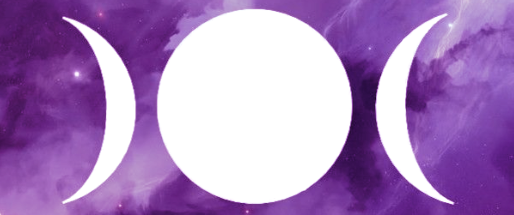

---
# Feel free to add content and custom Front Matter to this file.
# To modify the layout, see https://jekyllrb.com/docs/themes/#overriding-theme-defaults

layout: home
---

# All Bodies Lunar Meditation Circle

Join Lexa "Silver Wheel" on Thursdays for Community Lunar Meditation at [Studio 34 · Yoga · Healing · Arts](https://studio34yoga.com), 4522 Baltimore Avenue, Philadelphia, PA.

There is no cost to attend although donations are welcome. 

Lunar guided meditation allows for reclaiming the self by inspiring your inner voice and intuitive mind. Relax as you are taken into a journey of self discovery and transformation. Each lunar meditation is intended to bring us back to center, release and amplify the inner self, connect with the higher self, help us to grow just a little bit more, and gain tools to help in the coming week. This meditation circle is inclusive for all bodies, genders, orientations, and abilities. Each session will last about an hour including time for sharing and discussion.

This meditation circle is hosted by Lexa “Silver Wheel”, a recognized priestess, whose compassion-based practice uses tarot, crystals, astrology, reiki, color energy healing, and draws inspiration from her Panamanian family traditions as well as other traditions. Lexa is a High Priestess, Priestess of South Street Circle, Priestess in the Cabot Tradition and Cabot Kent Hermetic Temple, Community Organizer-Volunteer, Meditation Teacher, Reader, Reiki Certified, Artist, Writer, and a regular contributor to The Philly Pentacle.

### OCTOBER 17 at 7:00 pm

* Grounding and Planting Seeds
* Hunters Moon & Super Moon
* Waxing  & Full Moon

### OCTOBER  24 at 7:00 pm

* Community Healing 
* Waning Moon
* Last Quarter

### OCTOBER  31 at 7:00 pm

* Honoring Our Ancestors 
* Halloween · Samhain
* Waning Moon
* Fourth Quarter 


