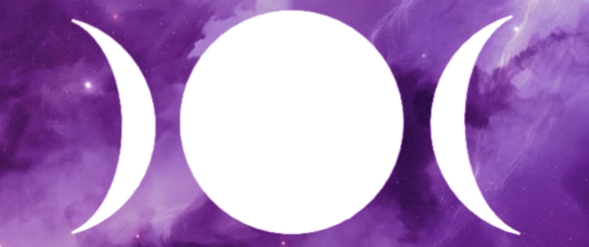

---
# Feel free to add content and custom Front Matter to this file.
# To modify the layout, see https://jekyllrb.com/docs/themes/#overriding-theme-defaults

layout: home
---

# All Bodies Lunar Meditation Circle

## The Invitation

Step into a dedicated space designed to help you slow down, breathe, and find your center again. This meditation circle is a grounded, welcoming environment where you can step away from the daily grind and focus on your personal well-being. Hosted by Lexa “Silver Wheel,” each session offers a supportive space for personal clarity, emotional reset, and deep relaxation.

Together, we will navigate the hidden currents of your inner world, anchoring ourselves in the enduring energies of the Earth, Sea, and Sky. Lexa uses a blend of practical structures and intuitive tools including tarot, oracle cards, crystals, astrology, reiki, and color energy healing to ensure everyone finds the exact blueprint they need to transform and recharge.

## The Foundation

Lexa’s practice brings together the vibrant, ancestral traditions of her Panamanian family and formal backgrounds in Western esotericism. As a High Priestess, a former Priestess of the South Street Circle, and a Priestess within the Cabot Tradition and Cabot Kent Hermetic Temple, she brings years of rigorous experience, clear structure, and real world wisdom to her work.

Her approach is balanced, intellectually clear, and down-to-earth, making it easy for people to find profound meaning in her sessions whether they are joining locally from her new homebase in Western Pennsylvania or tuning in from around the world.

## The Mission: Collective Evolution

Outside of hosting circles, Lexa is an active community organizer, volunteer, meditation teacher, intuitive reader, and Certified Usui Reiki Master. She is also an artist and writer who has dedicated her time to making complex spiritual practices accessible and supportive for others as she expands her work to a global community.

This circle isn't just about learning techniques; it’s an invitation to confront what holds you back and build a genuine, supportive community focused on collective evolution. Whether you have a lifelong practice or are just curious about taking your very first step, there is a place for you here.

## Meditation Circles

Lunar guided meditation allows for reclaiming the self by inspiring your inner voice and intuitive mind. Relax as you are taken into a journey of self discovery and transformation. Each lunar meditation is intended to bring us back to center, release and amplify the inner self, connect with the higher self, help us to grow just a little bit more, and gain tools to help in the coming week. This meditation circle is inclusive for all bodies, genders, orientations, and abilities. Each session will last about an hour including time for sharing and discussion.

If you have attended any of my meditatiom circles or want to know when the next one will be, I would love to hear from you. Sign up for my newsletter to keep in touch.




